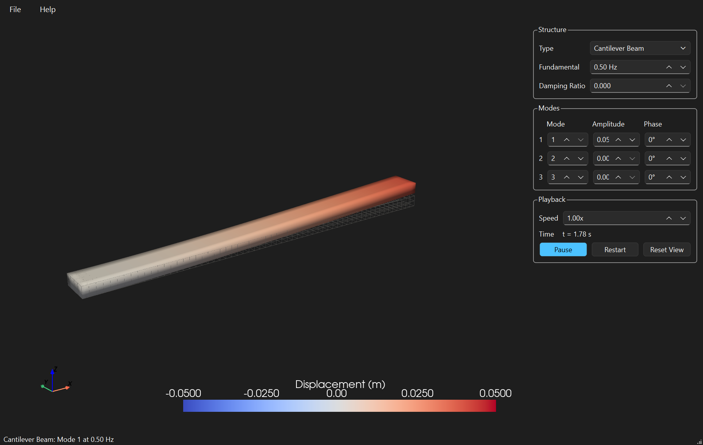

# Transverse Structural Vibration View — user manual

The app animates the free transverse vibration of a beam or plate in a 3D view that you can
rotate, pan and zoom while it moves. Mode shapes and frequency ratios come from closed-form
Euler-Bernoulli beam and Kirchhoff plate theory, so what you see is the textbook motion.

## The window

- **Left: the 3D view.** Drag with the left mouse button to rotate, right button or wheel to
  zoom, middle button (or Shift + left) to pan. The structure keeps vibrating while you do.
  The colour is the transverse displacement, blue down and red up, on a fixed scale so the
  colours mean the same thing from one frame to the next. The grey wireframe is the undeformed
  structure.
- **Right: the controls.** Every change takes effect immediately; nothing needs applying.
- **Bottom: the status bar.** It names the structure and the frequency of each active mode.

The window opens where you last closed it, at the same size, and maximised if it was.

## Structure

| Control | Meaning |
|---------|---------|
| Type | Cantilever beam, simply supported beam, clamped-clamped beam, or simply supported plate |

## Modes

The top of the group sets what every mode shares:

| Control | Meaning |
|---------|---------|
| Fundamental | Frequency of mode 1 in hertz. Higher modes are scaled from it using theory, so mode 2 of a cantilever runs at about 6.3 times this value |
| Damping Ratio | 0 keeps the motion going forever. Anything above 0 makes it decay; press **Restart** to kick it again |

Below that, up to three modes are superposed. For each row:

| Column | Meaning |
|--------|---------|
| Mode | Mode number, 1 to 6. For the plate, mode *k* is the *k*-th lowest, and the status bar shows its (m, n) half-wave numbers |
| Amplitude | Peak displacement as a fraction of the length. 0.05 on the 1 m beam is a 50 mm tip deflection. **0 switches the row off** |
| Phase | Starting phase in degrees, for watching how two modes interfere |

## Playback

| Control | Meaning |
|---------|---------|
| Speed | Multiplies the clock. Set it below 1 to watch a fast mode, or above 1 to see damping run out |
| Time | The animation clock, in seconds of structural time |
| Pause / Play | Freezes the structure at the current instant. You can still rotate it |
| Restart | Puts the clock back to zero, which is when every mode is at its peak |
| Reset View | Returns the camera to the three-quarter starting view and fits the structure |
| X-Z View | Looks square-on at the side of the structure, the best view of the deflected shape along its length |
| X-Y View | Looks straight down on the top face. On the plate, this shows the nodal lines as the white bands in the colour |
| Y-Z View | Looks along the length at the cross-section, so you see the ends move up and down |

## Theme

**Help > Theme** follows the Windows light or dark setting by default. The 3D view's background
and the colour bar text follow whichever theme is active.
